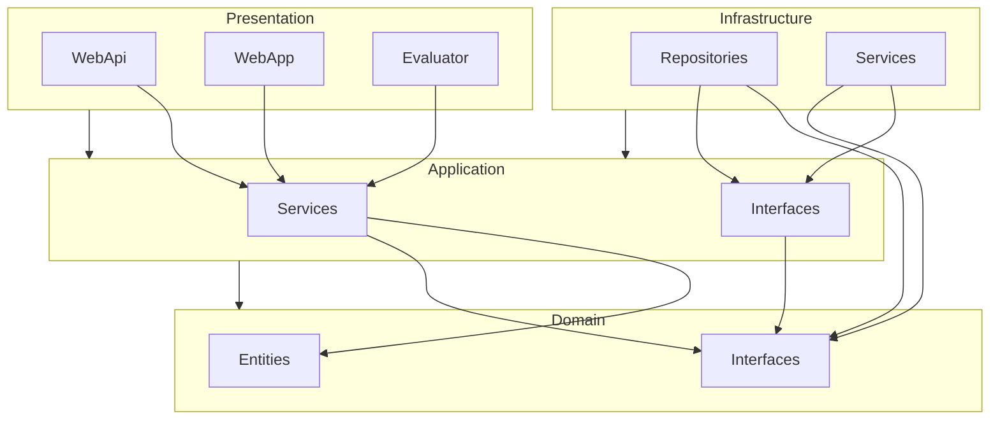

# Clean Code POC

This project demonstrates the implementation of a semantic search application using Qdrant vector database with Clean Architecture principles.

- [Blog](https://medium.com/t-t-software-solution/%E0%B8%9E%E0%B8%B1%E0%B8%92%E0%B8%99%E0%B8%B2-line-messaging-api-%E0%B8%94%E0%B9%89%E0%B8%A7%E0%B8%A2-net-f00a7e887a0b)
- [Video](https://youtu.be/R24-6j9cnsQ)

## Clean Architecture Structure

The project is organized into four main layers according to Clean Architecture:

### 1. Domain Layer

The core layer containing business entities and interfaces:
- **Entities**: Basic models like `Document` that are independent of any framework
- **Interfaces**: Core abstractions like `IRepository`

### 2. Application Layer

Contains business logic and application-specific interfaces:
- **Services**: Business logic implementations like `DocumentBusinessService`
- **Interfaces**: Application-specific interfaces like `IDocumentBusinessService` and `IEmbeddingInfraService`

### 3. Infrastructure Layer

Implements interfaces defined in the domain and application layers:
- **Repositories**: Data access implementations like `QdrantRepository`
- **Services**: External service integrations like `OpenAIEmbeddingInfraService`

### 4. Presentation Layer

User interface implementations:
- **WebAPI**: RESTful API endpoints for programmatic access
- **WebApp**: Browser-based user interface using MVC
- **Evaluator**: Console application for testing and evaluation

## Dependencies

The dependencies between layers flow inward according to Clean Architecture:
- Presentation → Application → Domain
- Infrastructure → Application → Domain

This ensures the core domain remains independent of external frameworks and technologies.

## Getting Started

1. Ensure you have .NET 8.0 SDK installed
2. Clone the repository
3. Build the solution: `dotnet build`
4. Run desired presentation layer:
   - Web API: `dotnet run --project src/Presentation/WebApi`
   - Web App: `dotnet run --project src/Presentation/WebApp`
   - Evaluator: `dotnet run --project src/Presentation/Evaluator`
